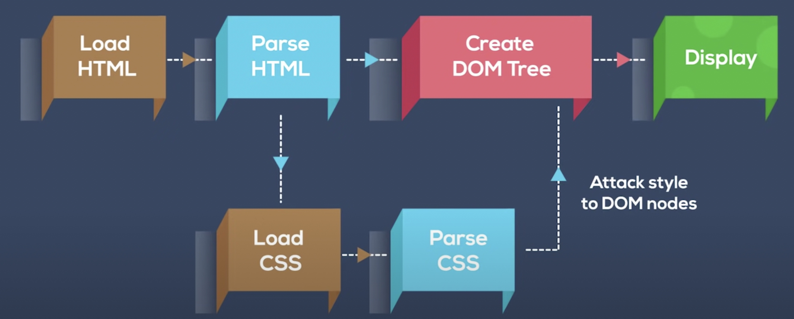

# DOM Model

## Introduction

The Document Object Model (DOM) is a programming API for web documents. It is a structural representation of the document and can be used to manipulate the content and structure of the document.

## DOM Model

The DOM represents a document as a tree of objects. The HTML elements become nodes in the tree. Let's consider a simple HTML document:

```html
<!DOCTYPE html>
<html>
  <body>
    <h1>My First Heading</h1>
    <p>My first paragraph.</p>
  </body>
</html>
```

The DOM tree of this HTML document would look like this:

```
Document
   |
   +- html
      |
      +- body
         |
         +- h1: "My First Heading"
         |
         +- p: "My first paragraph."
```

Each element in the document is a node, and the text inside the elements are also nodes.

# How HTML and CSS are Parsed and Converted to DOM Tree in the Browser



1. **Receiving Files:** The process begins when the browser sends a request to the server for the HTML and CSS files.

2. **HTML Parsing:** The browser parses the HTML file line by line. It understands the tags and their hierarchy, creating nodes of elements and text.

3. **Creating the DOM Tree:** As it parses the HTML, the browser constructs the Document Object Model (DOM) tree, which is a tree-like representation of the HTML document.

4. **CSS Parsing:** In parallel to HTML parsing, the browser also parses the CSS file. It understands the selectors, properties, and values.

5. **Creating the CSSOM Tree:** The parsed CSS is used to create the CSS Object Model (CSSOM) tree, a representation of the CSS rules to be applied to the HTML document.

6. **Creating the Render Tree:** The browser then combines the DOM tree and the CSSOM tree to create the render tree. The render tree includes both the HTML content and the CSS styling information for each visible node.

7. **Display**
   1. **Layout:** The browser calculates the exact position and size of each object on the render tree in a process known as layout or reflow.
   2. **Painting:** Finally, the browser fills in pixels: it rasterizes each node of the render tree into actual pixels on the screen in a process known as painting.

And voila! The webpage is rendered.
