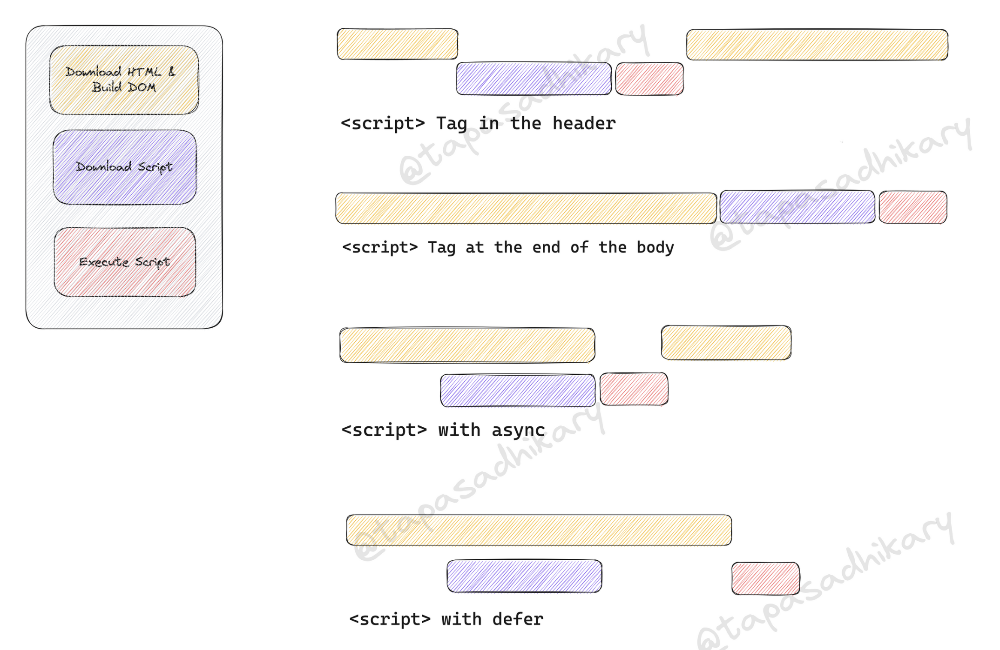

# DOM Selectors

# Basic selections exercise

```html
<!DOCTYPE html>
<html>
  <head>
    <style>
      .circle {
        height: 100px;
        width: 100px;
        border-radius: 50%;
        border: 1px solid black;
        margin: 10px;
      }
    </style>
  </head>
  <body>
    <div id="circle1" class="circle"></div>
    <div id="circle2" class="circle"></div>
    <div id="circle3" class="circle"></div>

    <script>
      // JS Code to colour the first circle red
    </script>
  </body>
</html>
```

## Solution

```js
document.getElementById("circle1").style.backgroundColor = "red";
```

All web APIs available at: https://developer.mozilla.org/en-US/docs/Web/API

## Step by step walkthrough of document.getElementById

This section will be explained in the class (console the selected elements)

How the document object is structured:

```js
const document = {
  getElementById: function () {
    console.log("It's a getElementById function");
  },
};

document.getElementById();
```

# All query selectors

The DOM provides various methods to select elements. These include:

1. `getElementById(id)`: Selects an element by its ID.

```javascript
let element = document.getElementById("circle1");
```

2. `getElementsByClassName(className)`: Selects elements by their class name.

```javascript
let elements = document.getElementsByClassName("circle");
```

3. `getElementsByTagName(tagName)`: Selects elements by their tag name.

```javascript
let elements = document.getElementsByTagName("div");
```

4. `querySelector(selector)`: Selects the first element that matches the CSS selector.

```javascript
let element = document.querySelector(".circle");
```

5. `querySelectorAll(selector)`: Selects all elements that match the CSS selector.

```javascript
let elements = document.querySelectorAll(".circle");
```

# JS Script Location

## Why we add JS Code at the End



Story of Restaurant with Ads widget will be explained in class

## Async

When the async attribute is present, the script is executed asynchronously with the rest of the webpage. The script is fetched in the background, and will execute as soon as it finishes downloading, regardless of where the parser is in the HTML document.

## Defer

The defer attribute tells the browser to defer the execution of the script until after the HTML parser has finished. Scripts with the defer attribute will execute in the order they were declared.

## Best Practices

Generally, it is recommended to place scripts at the bottom of the `<body>` to improve perceived page load times, unless you have a specific reason not to do so.

If your script is modular and does not rely on any DOM elements, using `async` is a good choice, as it allows the script to load in the background without blocking rendering.

If your script relies on the full DOM and should run before any `DOMContentLoaded` event handlers, `defer` is a good choice.

Order of including scripts matter in JavaScript because JavaScript is an interpreted language

## Interpreted Language

An interpreted language is a type of programming language for which most of its implementations execute instructions directly and freely, without previously compiling a program into machine-language instructions. JavaScript is considered an interpreted language because its scripts are processed line by line in real time by interpreters.

For JavaScript, the source code is sent to the browser where it is processed by the JavaScript Engine in the browser. Each browser has its own JavaScript Engine -- for example, Google Chrome uses V8, Firefox uses SpiderMonkey, and Safari uses JavaScriptCore (Nitro).

> Note: The JavaScript Engine parses the source code and turns it into an Abstract Syntax Tree (AST), then it generates bytecode from the AST. The bytecode is finally executed by a JavaScript virtual machine. It's worth mentioning that some modern JavaScript engines like V8 use a technique called Just-In-Time (JIT) compiling to compile the bytecode to machine code just before it's executed to improve performance.

```javascript
console.log("Hello, World!"); // JavaScript code that's interpreted line by line
console.log("Testing in the console");
```

## Compiled Languages

In contrast, a compiled language is a programming language whose implementations are typically compilers (translators that generate machine code from source code), and not interpreters (step-by-step executors of source code, where no pre-runtime translation takes place).

Java is an example of a compiled language. Before a Java program can be run, it must be converted from source code into bytecode by the Java Compiler. The bytecode is saved in a `.class` file and can be distributed. Before the bytecode is run, it's processed by the Java Virtual Machine (JVM), which converts the bytecode to machine code, which can be directly executed by the computer's hardware.

```java
public class HelloWorld {
    public static void main(String[] args) {
        System.out.println("Hello, World!"); // Java code that's compiled to bytecode
    }
}
```

## Differences Between Interpreted and Compiled Languages

Here are a few key differences between interpreted and compiled languages:

1. **Execution Speed**: Compiled languages like Java usually run faster because the code is fully compiled before it is run. Interpreted languages like JavaScript can be slower because the interpreter has to interpret the code while the program is running.

2. **Development Speed**: Interpreted languages can often be quicker to develop with because you can run your code immediately without having to wait for it to compile.
