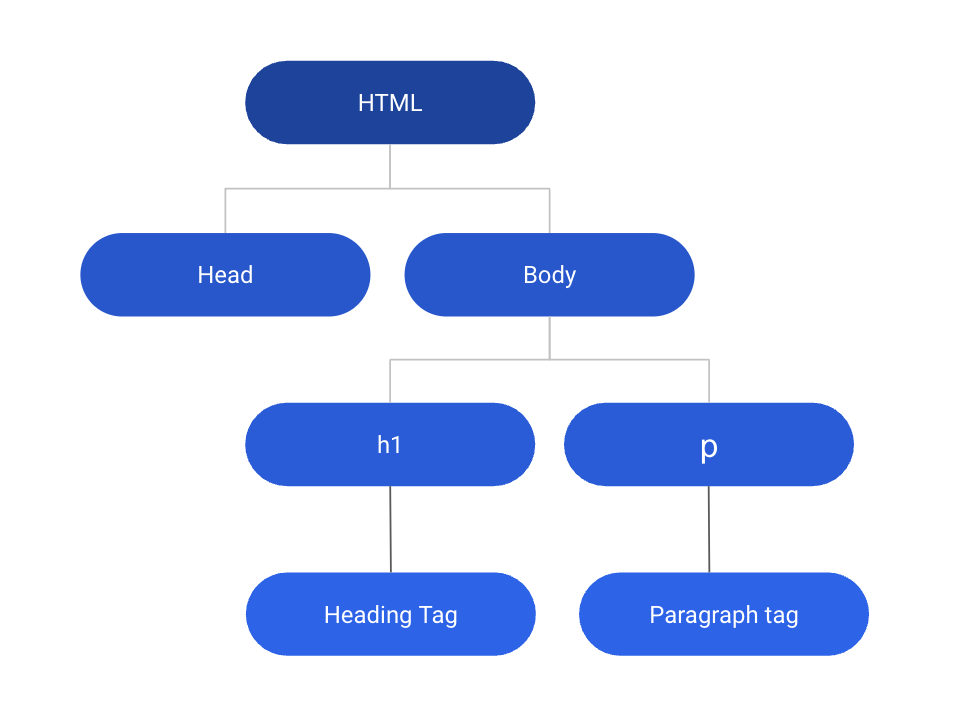
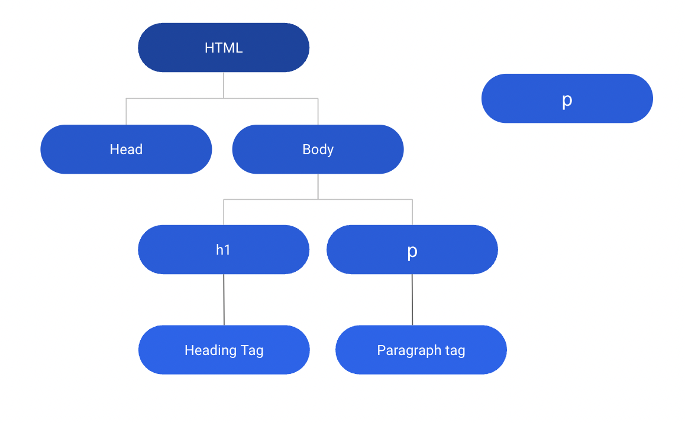
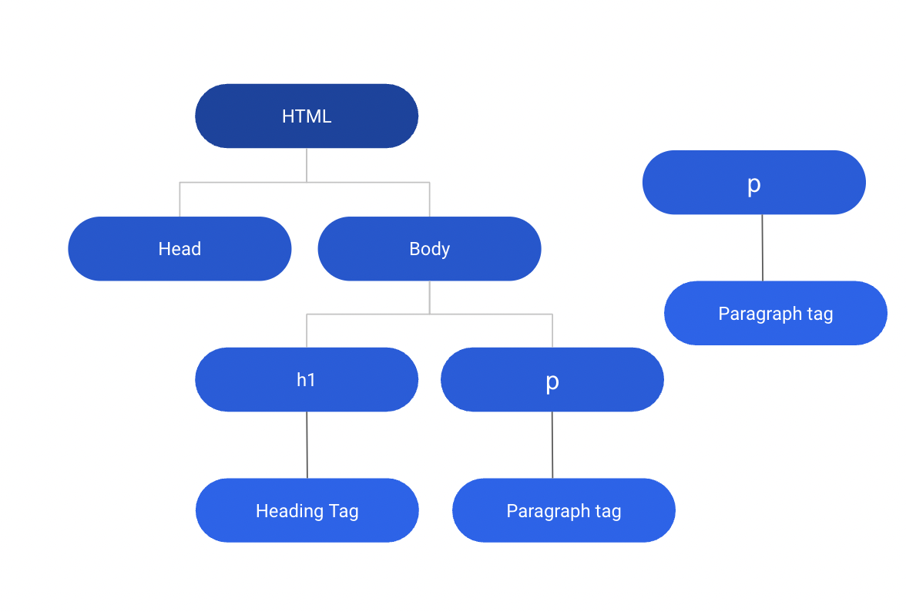
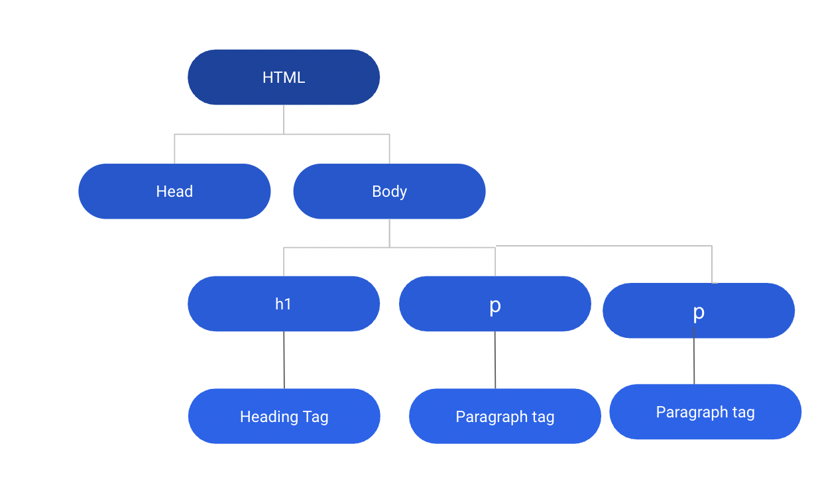

# DOM Manipulation

## Creating the following DOM Tree with JavaScript:






```html
<!DOCTYPE html>
<html>
  <head>
    <title>DOM Manipulation</title>
    <meta charset="UTF-8" />
  </head>

  <body>
    <h1>Heading Tag</h1>
    <p>Paragraph Tag</p>
    <script src="./src/index.js"></script>
  </body>
</html>
```

```js
// Create <p> element
let p = document.createElement("p");
let pText = document.createTextNode("Paragraph Tag");
p.appendChild(pText);

// Append <p> to the body
document.body.appendChild(p);
```

Once we have selected an element, we can manipulate it. Here are some common manipulations:

1. Change the content:

```javascript
let element = document.getElementById("myId");
element.innerHTML = "New content";
```

2. Change the attribute:

```javascript
let element = document.getElementById("myId");
element.setAttribute("data-test-id", "myTestID");
```

3. Change the style:

```javascript
let element = document.getElementById("myId");
element.style.color = "red";
```

4. Create and add a new element:

```javascript
let newElement = document.createElement("p");
newElement.innerHTML = "This is a new paragraph.";
document.body.appendChild(newElement);
```

5. Remove an element:

```javascript
let element = document.getElementById("myId");
element.remove();
```

6. Add classes:

```javascript
let element = document.getElementById("email");
element.classList.add("error");
```

## innerHTML vs innerText

`innerHTML` and `innerText` are both properties in JavaScript used to get or set the contents of a specified HTML element. While they serve similar purposes, they operate in different ways and have different use cases.

## innerHTML

`innerHTML` gets or sets the HTML content (HTML markup) of an element.

For example:

```javascript
let element = document.getElementById("myDiv");
console.log(element.innerHTML); // Returns the HTML content inside 'myDiv'
```

Setting `innerHTML` would look like this:

```javascript
element.innerHTML = "<p>New HTML Content</p>";
```

When setting the `innerHTML` property, you can include HTML tags in the new content, and those tags will be rendered as HTML. This can be useful if you need to dynamically generate complex HTML structures.

However, using `innerHTML` has its drawbacks. It's not recommended to use `innerHTML` when inserting text that may come from the user, as it poses a potential risk of script injection attacks (Cross-Site Scripting (XSS) attacks).

## innerText

`innerText` gets or sets the "rendered" text content of an element. What "rendered" means is that it approximates the text the user would get if they highlighted the contents of the element with the cursor and then copied to the clipboard.

Here's how you get `innerText`:

```javascript
let element = document.getElementById("myDiv");
console.log(element.innerText); // Returns the visible text inside 'myDiv'
```

And here's how you set `innerText`:

```javascript
element.innerText = "New Text Content";
```

Unlike `innerHTML`, `innerText` will not process any HTML tags as HTML, but instead treat them as literal text. This makes `innerText` safer to use when setting text content that may include user input.

## When to Use Which

- Use `innerHTML` when you need to get or set the HTML content of an element, and when you're sure that the content doesn't contain any user input or other untrusted content.
- Use `innerText` when you need to get or set the text content of an element, and especially when handling user input or other untrusted content that should not be parsed as HTML.
